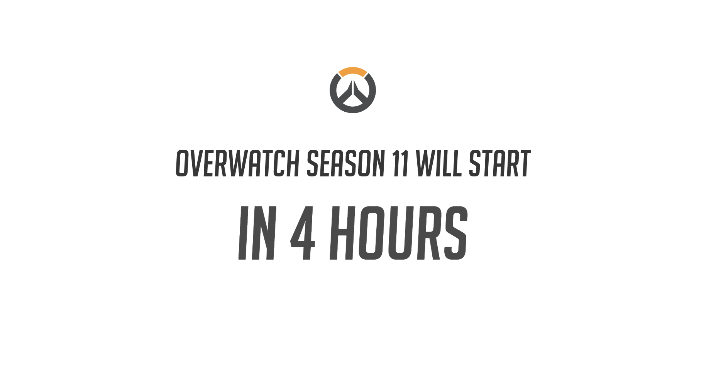

# Next Overwatch Season

> Solving the hassle of trying to figure out, when the next season will start!

## Build flow

I had some issues getting `inliner` to work with build scripts on Netlify, so for now this is done manually before pushing:

1. `npm run css` and move the Bulma part actually used to bulma.used.min.css
2. `npm run build`
3. Deploy

Should probably just switch to Gulp or another build tool.